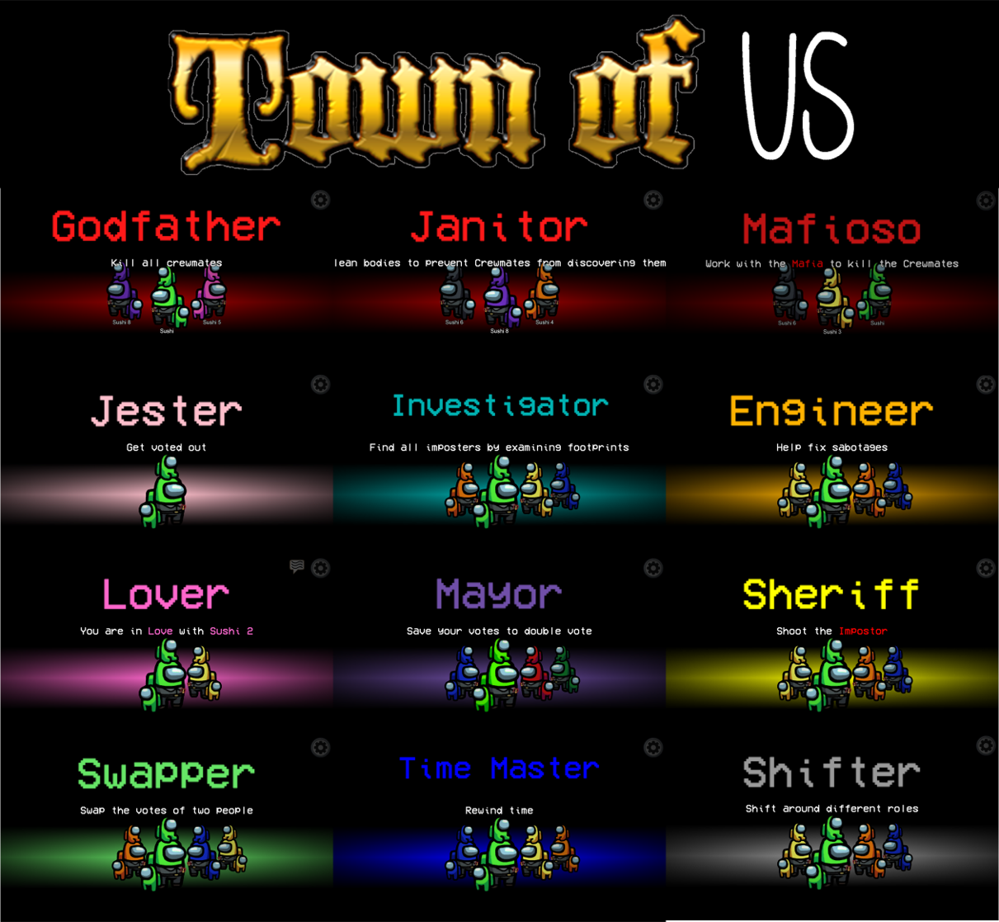

# 

An Among Us mod that adds a lot of mods and relevant game settings

There are 13 roles and 2 Modifiers
- [Mayor](#mayor)
- [Jester](#jester)
- [Sheriff](#sheriff)
- [Lovers](#lovers)
- [Mafia](#mafia)
  - Godfather
  - Janitor
  - Mafioso
- [Engineer](#engineer)
- [Swapper](#swapper)
- [Shifter](#shifter)
- [Investigator](#investigator)
- [Time Lord](#time-master)
  
New in v1.1.0
- [Medic](#medic)
- [Seer](#seer)
- [The Glitch](#the-glitch)
- [Morphling](#morphling)
- [Camouflager](#camouflager)
- [Executioner](#executioner)
- [Child](#child)

Modifiers:
- [Torch](#torch)
- [Diseased](#diseased)
- [Flash](#flash)

Modifiers

Roles might be added in the future

# Releases :
| Among Us - Version| Mod Version | Link |
|----------|-------------|-----------------|
| 2021.3.5s | v1.1.0 | [Download](https://github.com/slushiegoose/Town-Of-Us/releases/download/v1.1.0/TownOfUs-v1.1.0-2021.3.5s.zip) |
| 2020.12.19s | v1.1.0 | [Download](https://github.com/slushiegoose/Town-Of-Us/releases/download/v1.1.0/TownOfUs-v1.1.0-2020.12.9s.zip) |
| 2020.12.19s | v1.0.3 | [Download](https://github.com/slushiegoose/Town-Of-Us/releases/download/v1.0.3/TownOfUs-v1.0.3.zip) |
| 2020.12.19s | v1.0.2 | [Download](https://github.com/slushiegoose/Town-Of-Us/releases/download/v1.0.2/TownOfUs-v1.0.2.zip) |
| 2020.12.19s | v1.0.1 | [Download](https://github.com/slushiegoose/Town-Of-Us/releases/download/v1.0.1/TownOfUs-v1.0.1.zip) |
| 2020.12.19s | v1.0.0 | [Download](https://github.com/slushiegoose/Town-Of-Us/releases/download/v1.0.0/TownOfUs-v1.0.0.zip) |

  
 Changelog 

  <h3> <b> v1.1.0 </b> </h3>
  <ul>
    <li> New roles (see above)</a>
    <li> New modifiers (see above)</li>
    <li> The Engineer has been changed to the <a href="https://github.com/NotHunter101/ExtraRolesAmongUs">ExtraRoles</a> version </li>
    <li> Backend overhaul! This will make it easier to add new roles </li>
    <li> New Button Art! </li>
    <li> Maps and Impostor Count can be changed from the Lobby! </li>
    <li> Shadows for the Custom Colours </li>
    <li> Fixes </li>
    <ul>
      <li> The Jester and The Shifter unable to fix Sabotages </li>
      <li> The Time Lord's Rewind not auto-force closing tasks </li>
      <li> The Q button not working for Sheriff </li>
      <li> The Shifter's Shift looking too much like a Kill </li>
      <li> Changing colours would render you weirdly green in normal Among Us </li>
    </ul>
  </ul>
  

  <h3> <b> v1.0.3 </b> </h3>
  
 Fixes: 

  <ul>
    <li> Engineer being able to Fix every sabotage </li>
    <li> The Investigator being able to revive people voted out (and instead made it an option) </li>
    <li> Footprints not appearing if a person walks over old footprints </li>
    <li> Graphical glitch where Jester and Lovers simultaneously win </li>
    <li> Players spawning back into positions from the last game when time is rewound right at the beginning of a new game </li>
    <li> Graphical Bug of Time Lord's name not being blue in Meetings </li>
    <li> Fixed Medbay Scan not working for custom colours </li>
  </ul>
  

  <h3> <b> v1.0.2 </b> </h3>
  
 Fixes: 

  <ul>
    <li>  The Swapper being unable to vote </li>
    Swapper unable to vote
    <li> Mayor Vote Bank ending up negative </li>
    <li> Anonymous Voting not working when Mayor is in a game </li>
    <li> Chats not working in the lobby </li>
    <li> Sheriff desync (I think) </li>
    <li> Buttons being able to be used during meetings </li>
  </ul>
  

  <h3> <b> v1.0.1 </b> </h3>
  
 Fixes errors of not being able to launch. 

# Installation
**Download the zip file on the right side of Github.**  
1. Find the folder of your game, for steams players you can right click in steam, on the game, a menu will appear proposing you to go to the folders.
2. Make a copy of your game (not required but recommended)
3. Drag or extract the files from the zip into your game, at the .exe level.
4. Turn on the game.
5. Play the game.

# Roles
## Mayor
### **Team: Crewmates**
The Mayor is a role that can vote multiple times.\
The Mayor has a Vote Bank, which is the number of times they can vote.\
Every time they don't vote in a meeting, one vote is added to the Vote Bank.\
During a meeting, so long as not everyone has voted, the Mayor can use a vote or multiple votes from their Vote Bank to vote multiple times.\
However, to compensate for this, the Mayor cannot fix Lights or Comms.

### Game Options
| Name | Description | Type | Default |
|----------|:-------------:|:------:|:------:|
| Mayor | The percentage probability of the Mayor appearing | Number | 0% |
| Mayor Vote Bank | The number of votes in the Vote Bank to start with. | Number | 1 |

-----------------------
## Jester
### **Team: Neutral**
The Jester has zero tasks and their aim is to be voted out.\
If they are voted out then the game finishes and they win.\
However, the Jester does not win if the Crewmates or Impostor wins.

### Game Options
| Name | Description | Type | Default |
|----------|:-------------:|:------:|:------:|
| Jester | The percentage probability of the Jester appearing | Number | 0% |

-----------------------
## Sheriff
### **Team: Crewmates**
The Sheriff's aim is able to kill and their aim is to kill Impostors or The Glitch.\
However, if they attempt to kill a Crewmate or a different Neutral character, they instead die themselves.

### Game Options
| Name | Description | Type | Default |
|----------|:-------------:|:------:|:------:|
| Sheriff | The percentage probability of the Sheriff appearing | Number | 0% |
| Show Sheriff | Whether everybody can see who the Sheriff is | Toggle | False |
| Sheriff Kill Cooldown | The cooldown of the Sheriff's kill | Number | 25s |
| Sheriff Kills Jester | Whether the Sheriff kills the Jester | Toggle | False |
| Sheriff Misfire Kills Crewmate | Whether the Crewmate is killed if the Sheriff Misfires | Toggle | False |

-----------------------
## Lovers
### **Team: Either Crewmates or Impostors**
The Lovers are two players who are linked together.\
They gain the primary objective to stay alive together.\
If  they are both among the last 3 players, they win.\
However, they can also win with their respective team and hence the Lovers do not know the role of the other lover.\
There is a 66.7% chance that both Lovers are Crewmates.\
There is a 33.3% chance that one Lover is a Crewmate and one is an Impostor.

### Game Options
| Name | Description | Type | Default |
|----------|:-------------:|:------:|:------:|
| Lovers | The percentage probability of the Lovers appearing | Number | 0% |
| Both Lovers Die | Whether the other lover automatically suicides if the other dies | Toggle | True |

-----------------------
## Mafia
### **Team: Impostors**
The Mafia are a group of three Impostors.\
The Godfather is a normal impostor and can sabotage and kill.\
The Janitor is an impostor who cannot kill but can instead clean up bodies so that they can't be seen nor reported.\
The Mafioso is an impostor who cannot sabotage nor kill until the Godfather is dead.\
**NOTE** - The Mafia only appears in games of 3+ impostors, even when set to a 100% chance.

### Game Options
| Name | Description | Type | Default |
|----------|:-------------:|:------:|:------:|
| Mafia | The percentage probability of the Mafia appearing | Number | 0% |
| Janitor Clean Cooldown | The cooldown of the Janitor's cleaning | Number | 25s |
| Two-Imp Mafia | Only the Godfather and Janitor spawn | Toggle | False |
| Janitor Kill on Sole Impostor | The Janitor becomes able to kill if they are the last impostor | Toggle | False |

-----------------------
## Engineer
### **Team: Crewmates**
The Engineer can fix one sabotage per game from anywhere on the map.\
The Engineer can also vent.\

### Game Options
| Name | Description | Type | Default |
|----------|:-------------:|:------:|:------:|
| Engineer | The percentage probability of the Engineer appearing | Number | 0% |

-----------------------
## Shifter
### **Team: Neutral**
The Shifter is a roleless character.\
They have zero tasks and zero win conditions.\
However they can swap roles with people.\
Swapping roles with a custom role gives the Shifter the role and their tasks and turns the other player into a crewmate.\
Swapping roles with a Crewmate swaps tasks.\
Swapping roles with an Impostor fails and kills the Shifter.

### Game Options
| Name | Description | Type | Default |
|----------|:-------------:|:------:|:------:|
| Shifter | The percentage probability of the Shifter appearing | Number | 0% |

-----------------------
## Swapper
### **Team: Crewmates**
The Swapper can swap two people's votes during a Meeting.\
Everyone who voted for the first person will instead be counted for the second and vice versa.\
This could easily change the outcome of a vote and perhaps vote off a different person.\
To counteract this, The Swapper cannot fix Lights or Comms and cannot push the Emergency Button.

### Game Options
| Name | Description | Type | Default |
|----------|:-------------:|:------:|:------:|
| Swapper | The percentage probability of the Swapper appearing | Number | 0% |

-----------------------
## Investigator
### **Team: Crewmates**
The Investigator can see the movement of players.\
Every player leaves a footprint that only the Investigator can see, which disappears after some time.\

### Game Options
| Name | Description | Type | Default |
|----------|:-------------:|:------:|:------:|
| Investigator | The percentage probability of the Investigator appearing | Number | 0% |
| Footprint Size | The size of the footprint on a scale of 1 to 10 | Number | 4 |
| Footprint Interval | The time between two footprints | Number | 1s |
| Footprint Duration | The amount of time that the footprint stays on the ground | Number | 10s |
| Anonymous Footprint | When enabled, all footprints are grey rather than the player color | Toogle | False
| Footprint Vent Visible | Whether footprints near vents are shown | Toggle | False

-----------------------
## Time Lord
### **Team: Crewmates**
The Time Lord can rewind time and all plaers will reverse.\
If enabled, any players killed during this time will be revived.\
Nothing but movements and kills are affected (for now).

### Game Options
| Name | Description | Type | Default |
|----------|:-------------:|:------:|:------:|
| Time Lord | The percentage probability of the Time Lord appearing | Number | 0% |
| Revive During Rewind | Whether to revive dead players when rewinding | Toggle | False |
| Rewind Duration | How far to rewind back time | Number | 3s |
| Rewind Cooldown | The cooldown of the Time Lord's Rewind | Number | 25s |
| Revive Voted Out | Whether people voted out are revived if time   is rewound just after a meeting finishes | Toggle | False |

-----------------------
## Medic
### **Team: Crewmates**
The Medic can give any player a shield that will make them immortal until the Medic dies.\
A shielded player cannot be Shifted, Hacked or Killed by anyone, unless by suicide.\
If the Medic reports a dead body, they can get a report containing clues to the Killer's identity.\
A report can contain the name of the killer or the color type (Darker/Lighter)
### Colors
- Red - Darker
- Blue - Darker
- Green - Darker
- Pink - Lighter
- Orange - Lighter
- Yellow - Lighter
- Black - Darker
- White - Lighter
- Purple - Darker
- Brown - Darker
- Cyan - Lighter
- Lime - Lighter
- Watermelon - Darker
- Chocolate - Darker
- Sky Blue - Lighter
- Beige - Darker
- Hot Pink - Lighter
- Turquoise - Lighter
- Rainbow - Lighter
### Game Options
| Name | Description | Type | Default |
|----------|:-------------:|:------:|:------:|
| Medic | The percentage probability of the Medic appearing | Number | 0% |
| Show Shielded Player | Who should be able to see who is Shielded | Self / Medic / Self + Medic / Everyone | Self |
| Murder Attempt Indicator for Shielded Player | Whether the Shielded player gets an indicator when someone tries to Kill, Shift or Hack them. | Toggle | False |
| Show Medic Reports | Whether the Medic should get information when reporting a body | Toggle | True |
| Time Where Medic Reports Will Have Name | If a body is dead for shorter than this amount, the Medic's report will contain the killer's name | Number | 0s |
| Time Where Medic Reports Will Have Color Type | If a body is dead for shorter than this amount, the Medic's report will have the type of color | Number | 15s |

-----------------------
## Seer
### **Team: Crewmates**
The Seer can reveal roles and find out who they are.\
Based on settings, the Seer can find out whether a role is Good, Evil or Neutral or the actual role.\
A person's name will change color to their Team or their Role.\
If the Seer investigates someone, the Seer's name will change colour to inform the player who the Seer is.
### Game Options
| Name | Description | Type | Default |
|----------|:-------------:|:------:|:------:|
| Seer | The percentage probability of the Seer appearing | Number | 0% |
| Seer Cooldown | The Cooldown of the Seer's Reveal | Number | 25s |
| Info that Seer sees | Whether the Seer sees the Role or the Team of a player | Role / Team | Role |
| Who Sees That They Are Revealed | Which roles see the Seer's identity once the Seer has seen their role | Crewmates / Impostors + Neutral / All / Nobody | Crewmates |
| Neutrals show up as Impostors | When the Info is set to Team, Neutral roles show up as Red, like Impostors | Toggle | False |

-----------------------
## The Glitch
### **Team: Neutral**

The Glitch is on a team of its own is able to kill.\
The Glitch can hack.\
Hacking a crewmate results in them unable to report bodies and unable to do tasks.\
Hacking an impostor results in them unable to kill, sabotage or report.\
The Glitch can mimic someone, which results in them looking like the other person.\
The Glitch's aim is to kill __everyone__ and be the last person standing.\

### Game Options
| Name | Description | Type | Default |
|----------|:-------------:|:------:|:------:|
| The Glitch | The percentage probability of The Glitch appearing | Number | 0% |
| Mimic Cooldown | The Cooldown of The Glitch's Mimic | Number | 30s |
| Mimic Duration | How long The Glitch can Mimic a player | Number | 10s |
| Hack Cooldown | The Cooldown of The Glitch's Hack | Number | 30s |
| Hack Duration | How long The Glitch can Hack a player | Number | 10s |
| Glitch Kill Cooldown | The Cooldown of the Glitch's Kill | Number | 10s |
| Glitch Hack Distance | How far away The Glitch can Hack someone from | Short / Normal / Long | Short |

-----------------------
## Morphling
### **Team: Impostors**

The Morphling is an impostor that can morph into another player.\
At the beginning of the game and after every meeting, they can choose someone to sample.\
They can then morph into that person at any time for a limited amount of time.\
They cannot vent.

### Game Options
| Name | Description | Type | Default |
|----------|:-------------:|:------:|:------:|
| Morphling | The percentage probability of the Morphling appearing | Number | 0% |
| Morph Cooldown | The Cooldown of the Morphling's Morph | Number | 30s |
| Morph Duration | How long the Morphling can Morph into a player | Number | 10s |

-----------------------
## Camouflager
### **Team: Impostors**

The Camouflager is an impostor that can turn everyone grey.\
Everyone goes grey for a certain period of time.

### Game Options
| Name | Description | Type | Default |
|----------|:-------------:|:------:|:------:|
| Camouflager | The percentage probability of the Camouflager appearing | Number | 0% |
| Camouflage Cooldown | The Cooldown of the Camouflager's Camouflage | Number | 30s |
| Camouflage Duration | How long the Camouflager can Camouflage | Number | 10s |

-----------------------
## Executioner
### **Team: Neutral**

The Executioner is a neutral role who's aim is to vote out a crewmate.
If that crewmate gets voted out, they win.
### Game Options
| Name | Description | Type | Default |
|----------|:-------------:|:------:|:------:|
| Executioner | The percentage probability of the Executioner appearing | Number | 0% |

-----------------------
## Child
### **Team: Crewmates**

The Child cannot be killed. If the Child is killed, everybody loses.
### Game Options
| Name | Description | Type | Default |
|----------|:-------------:|:------:|:------:|
| Child | The percentage probability of the Child appearing | Number | 0% |

-----------------------

# Modifiers
## Torch
### **Applied to: Crewmates**
The Torch can see in the dark and could perhaps catch out an Impostor
### Game Options
| Name | Description | Type | Default |
|----------|:-------------:|:------:|:------:|
| Torch | The percentage probability of the Torch appearing | Number | 0% |

-----------------------
## Diseased
### **Applied to: Crewmates**
Killing the diseased triples the Impostor's cooldown.
### Game Options
| Name | Description | Type | Default |
|----------|:-------------:|:------:|:------:|
| Diseased | The percentage probability of the Diseased appearing | Number | 0% |

-----------------------
## Flash
### **Applied to: All**
Player travels at double speed.
### Game Options
| Name | Description | Type | Default |
|----------|:-------------:|:------:|:------:|
| Flash | The percentage probability of the Flash appearing | Number | 0% |

-----------------------
## Extras
### New Colors!
New colors are added for crewmates so that they can be more colors
### Rainbow Color!
A rainbow color has also been added. Anyone who equips this color will constantly switch between the colors of the rainbow.

# Bug / Suggestions
If you have any bugs or any need to contact me, join the [Discord server](https://discord.gg/bYSaT74KzT) or create a ticket on GitHub

# Credits & Resources
[Reactor](https://github.com/NuclearPowered/Reactor) - The framework of the mod\
[BepInEx](https://github.com/BepInEx) - For hooking game functions\
[Essentials](https://github.com/DorCoMaNdO/Reactor-Essentials) - For created custom game options.\
[Among-Us-Sheriff-Mod](https://github.com/Woodi-dev/Among-Us-Sheriff-Mod) - For the Sheriff role.\
[Among-Us-Love-Couple-Mod](https://github.com/Woodi-dev/Among-Us-Love-Couple-Mod) - For the inspiration of Lovers role.\
[ExtraRolesAmongUs](https://github.com/NotHunter101/ExtraRolesAmongUs) - For the Engineer & Medic roles.\
[TooManyRolesMods](https://github.com/Hardel-DW/TooManyRolesMods) - For the Investigator & Time Lord roles.\
[TorchMod](https://github.com/tomozbot/TorchMod) - For the inspirtation of the Torch Mod.\
[XtraCube](https://github.com/XtraCube) - For the RainbowMod.\
[PhasmoFireGod](https://twitch.tv/PhasmoFireGod) - Button Art.\
[TheOtherRoles](https://github.com/Eisbison/TheOtherRoles) for the inspiration of the Child and Spy roles.
